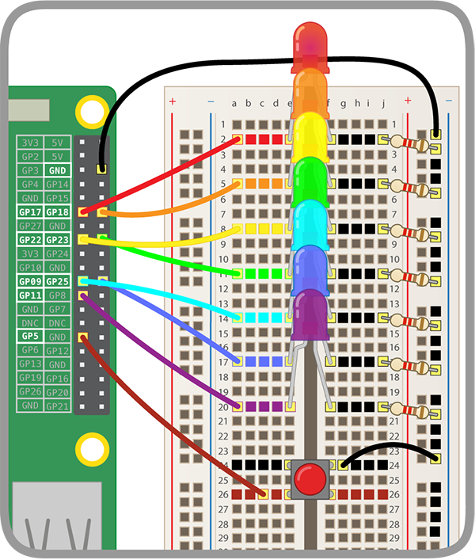

## Add a button

You will now make your rainbow flash and your unicorn dance in time by pressing a button!

### Connect the button

+ Connect your button to the breadboard and a GPIO pin.

Click below for instructions on how to connect a button to the Raspberry Pi. Note that, instead of **GPIO 17** like the instructions say, we've used **GPIO 5** for the button — **GPIO 17** is already taken by an LED.

[[[rpi-gpio-wiring-a-button]]]

Your rainbow should now look something like this:

### Code the button

+ Configure your button in Scratch.

[[[rpi-scratch-button]]]

### Control the unicorn dance

At the moment, you should have three chunks of Scratch code:
1. Dancing unicorn code
1. Blinking rainbow code
1. Button code

You will now connect these chunks so that your unicorn dances in time to your rainbow, and so that you can control the rainbow and unicorn by pressing the button you've added.

+ Delete all of the `say`{:class="blocklooks"} blocks in the code for the button, and then duplicate this chunk of code.

+ In your code for the unicorn dance, delete the `when flag clicked`{:class="blockevents"} block. Take the rest of the unicorn code, and slot it into the `else`{:class="blockcontrol"} block of your button code. Only slot it into **one copy** of the button code.

+ In the rainbow code, delete the `when flag clicked`{:class="blockevents"} block and slot the rest of the rainbow code into the `else`{:class="blockcontrol"} block of the **other copy** of the button code.

+ In the `if`{:class="blockcontrol"} slot of both copies of your button code, add an action. You could use `switch costume to first costume`{:class="blocklooks"}, so your unicorn doesn't get its dance moves mixed up.

--- hints ---
--- hint ---
If pressing the button doesn't make the rainbow light up and the unicorn dance in time, try checking that:
1. Every component is connected to the right GPIO pin
1. You've got the inputs and outputs right in your code
1. The timings match for your two chunks of code
1. You've used all the right code blocks
--- /hint ---
--- /hints ---

--- challenge ---

+ Have some fun with your dancing unicorn rainbow!

--- collapse ---

---
title: Dancing unicorn rainbow challenges
---

Ideas:
1. Make the blinking of your rainbow and the dance of your unicorn faster
1. Teach your unicorn a new dance (play around with costumes and speeds)
1. Add more buttons and make the unicorn do a different dance for each
1. Add more `events`{:class="blockevents"} to make the unicorn do different dances
1. Make a game with your rainbow and dancing unicorn

--- /collapse ---

--- /challenge ---
