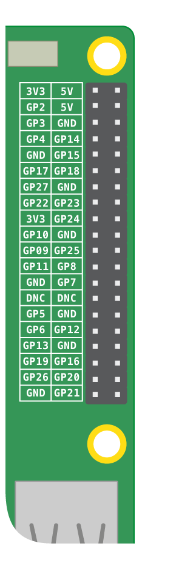

## Your rainbow's atmosphere

Before making a rainbow, you need to learn how to control it. You will power and control your rainbow with the help of the Raspberry Pi's **GPIO** pins. GPIO is an acronym for **G**eneral **P**urpose **I**nput/**O**utput.

The Pi's GPIO pins allow you to send and receive on/off signals to and from electronic components — for example LEDs, motors, buttons, and buzzers.

If you look at your Pi with the USB ports facing towards you, this is the pin layout:

A Raspberry Pi has 26 GPIO pins. In the image above, these are the pins labelled with GP and a number.

+ To read a little more about GPIO pins, click here:

[[[rpi-gpio-pins]]]
