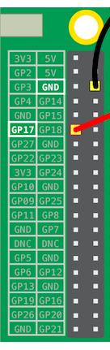

## Test your circuit in Scratch

You will now connect your circuit and first rainbow colour to Scratch, so that you can code a Scratch program to control the LED.

+ Open up Scratch 2 on your Raspberry Pi. Reminder: this step will **not** work with Scratch online or with Scratch 1.4.

+ In the previous step, you connected your LED to pin **3V3**. This is the pin to connect to if you are testing your LED. You now need to connect your LED to a pin you can control with Scratch. Move the wire from pin **3V3** to a new pin, for example **GPIO 17**.

+ Follow these instructions to control your LED with Scratch:

[[[rpi-scratch-add-pi-gpio]]]

[[[rpi-scratch-control-led]]]
