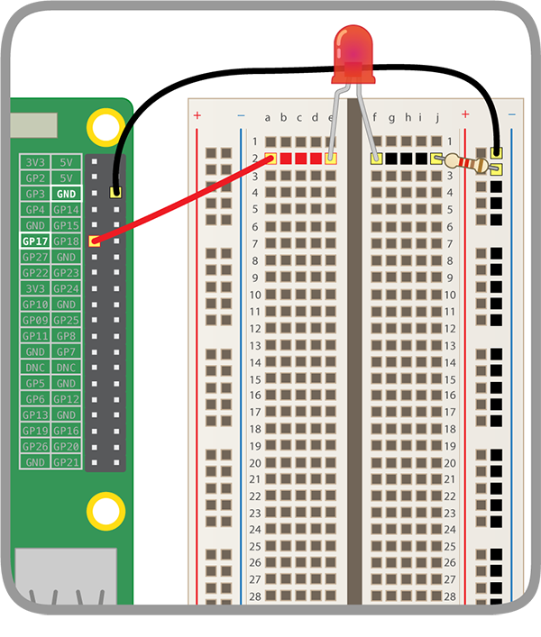
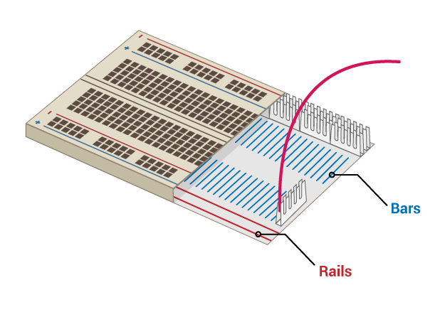
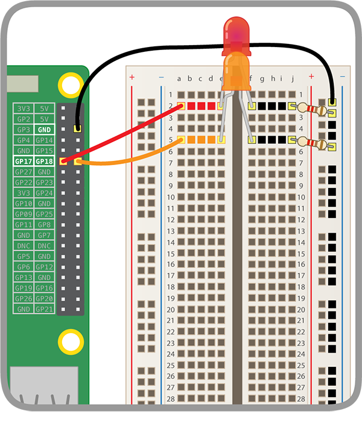

## Build your rainbow

In this step, you will assemble your rainbow and program its LEDs to blink in a rainbow pattern.

+ Find all the LEDs you are going to use, and make sure you also have the right number of jumper wires and resistors (one each per LED).

+ Rearrange the circuit you already have to make room for the other colours of your rainbow.

### Ground the rainbow

So that your rainbow shines brightly and is not covered by too many jumper wires, all LEDs should share one **Ground (GND)** pin. You can do set them up like this by rearranging your components on the breadboard a little.

The breadboard looks like this inside:

To ground the whole rainbow with one jumper wire:
+ Connect the jumper wire attached to **GND** to a breadboard **rail**
+ Make sure resistors connect to the same rail as the **GND** jumper wire and to the same **bar** as the LED they belong to:

### Complete the rainbow

+ Add the rest of your LEDs, jumper wires, and resistors to the breadboard in a colour arrangement of your choice. Make sure to leave room for a button at the end.

If you are using many different colours, it might help to match the colour of the jumper wires to your LEDs.

Your rainbow should look similar to this one:

