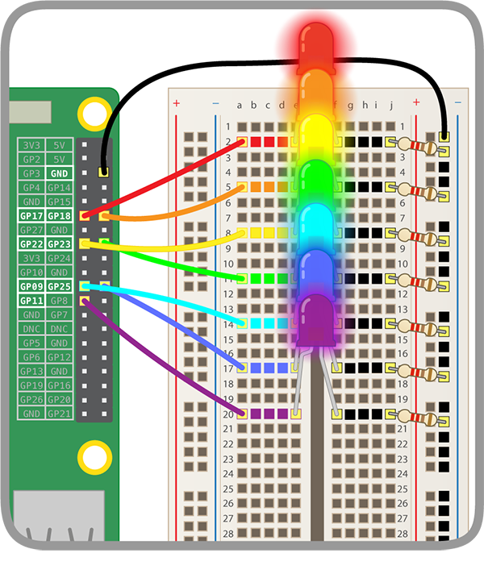

## Light your rainbow

To make sure your rainbow is working, you will first test it by lighting the whole rainbow at once. You will then create code to make the rainbow blink through all its colours one after the other, and then in a pattern of your choice.

+ Add more code to control the other LEDs. Make sure you include the right GPIO pins.

Your rainbow should light up like this:



--- hints ---
--- hint ---
Add more `set gpio () to output high`{:class="blockmoreblocks"} blocks in this chunk of code:
```blocks  
	when flag clicked
	set gpio (17) to [output high v] :: extension
```
--- /hint ---
--- hint ---
Keep adding blocks at the bottom of your code until all your GPIO pins are set to `output high`{:class="blockmoreblocks"}.
```blocks  
	when flag clicked
	set gpio (17) to [output high v] :: extension
  set gpio (18) to [output high v] :: extension
  set gpio (22) to [output high v] :: extension
```
...
--- /hint ---
--- hint ---

If your LEDs are not lighting:

1) Check which GPIO pins your LEDs are connected to, and make sure you have set them to `output high`{:class="blockmoreblocks"}
2) Test whether the LEDs are working — you can plug an LED's jumper wire into **GPIO 3V3** to test it
3) Make sure the circuit on the breadboard is complete

--- /hint ---
--- /hints ---

+ Now, add more code to make the rainbow blink in a rainbow pattern like this:

<video width="560" height="315" controls>
<source src="resources/Scratch-GPIO-Pathways-5.mp4" type="video/mp4">
Your browser does not support the video tag, so try FireFox or Chrome.
</video>

To do this, you will need to make one LED turn on for a couple of seconds and then turn off at the same time as the next LED turns on.

--- hints ---
--- hint ---

Make sure your `Events`{:class="blockevents"} block matches what you are doing to test the code. In the example here, to make our rainbow blink, we have to click the green flag:
```blocks
  when flag clicked
```
--- /hint ---
--- hint ---

If you're stuck, make sure you are using these blocks:
```blocks
	set gpio () to [output low v] :: extension
  wait () secs
```

--- /hint ---
--- hint ---

Try using this approach:
```blocks  
	when flag clicked
	set gpio (17) to [output high v] :: extension
  wait (0.5) secs
  set gpio (17) to [output low v] :: extension
  set gpio (18) to [output high v] :: extension
  wait (0.5) secs
  set gpio (18) to [output low v] :: extension
  set gpio (22) to [output high v] :: extension
```

You will need to add blocks for all your LEDs and make sure that you're using the right GPIO pin numbers in your code.

--- /hint ---
--- /hints ---

+ Make the lights blink repeatedly through the rainbow in a loop.

To loop through the rainbow pattern forever, use:

```blocks
forever
```

--- challenge ---

+ Make the rainbow blink in a pattern of your choice.

--- collapse ---

---
title: Rainbow challenges
---

Try out the following ideas:

  1) Make the LEDs blink very fast and very slow
  2) Make the whole rainbow blink
  3) Make pairs of LEDs light up in alternate patterns
  4) Make the rainbow blink something in Morse code
  5) Make the rainbow do different things in response to different events

--- /collapse ---
--- /challenge ---
